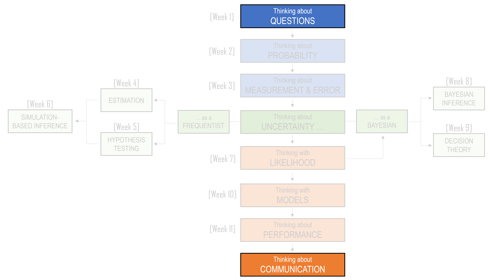

# Preface {.unnumbered}

This book accompanies the main text that is used as the notes for the seminars. That text introduces the ideas, stories, and concepts that shape statistical thinking. This book is different. It is designed for the tutorials, where you will practice using those ideas.

This is a second-year unit, so most of you will have encountered R/RStudio in an earlier unit (such as ETC1000 or ETC1100). If you would like a refresher on some of the assumed R knowledge, please see the following chapters from the ETC1000 textbook:

-   [Introduction to R](https://m2huynh.github.io/ETC1000/07-Introduction-to-R.html)
-   [The tidyverse](https://m2huynh.github.io/ETC1000/08-The-tidyverse.html)

A major emphasis in this companion book is the use of **Quarto**. Quarto allows you to combine writing, code, output, tables, figures, and interpretation in a single document. This is important because statistical work is not just about producing an answer. It is about showing how you got there, explaining why the method is appropriate, and **communicating your findings clearly** (in fact, all of the different topics in this unit lead us to this idea of communication, see the unit outline below).

<center>
```{r, echo=FALSE}
#| classes: .enlarge-image

```
</center><br>

In this unit, Quarto will help you develop the habit of writing statistical work as a reproducible document. A reproducible document is one where the code, results, and explanation live together. This means that if the data change, or if you need to correct your analysis, you can rerun the document and update the results. More importantly, it encourages you to connect the technical parts of statistics with the written interpretation.

Each chapter in this book follows the seminar content, but the focus is practical. You will be asked to write code, modify examples, interpret results, answer conceptual questions, and complete tutorial exercises. Some activities are highly guided. Others ask you to work more independently. This is intentional. The goal is to move from copying and understanding code, to adapting code, to using code to answer statistical questions.

You do not need to memorise every R function. Instead, you should focus on understanding what the code is doing. When you see a new function, ask:

-   What does this function do?
-   What data or arguments does it need?
-   What does it return?
-   How does the output help answer the statistical question?

Throughout this book, you will see a mix of coding tasks, short written questions, interpretation prompts, and extension activities. The coding tasks are there to help you develop technical fluency. The written questions are there to help you slow down and think. The interpretation prompts are there to remind you that statistics is about evidence, uncertainty, and communication, not just computation.

You are encouraged to experiment. Change values. Rerun code. Break things and fix them. Try a different sample size. Change a prior. Modify a plot. Replace one variable with another. Much of statistical learning happens when you ask,

> “What happens if I change this?”
