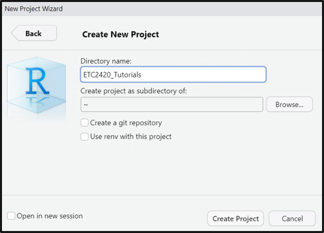
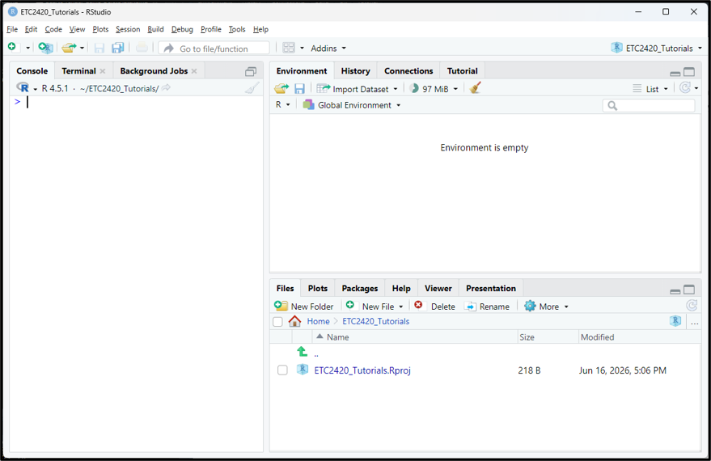
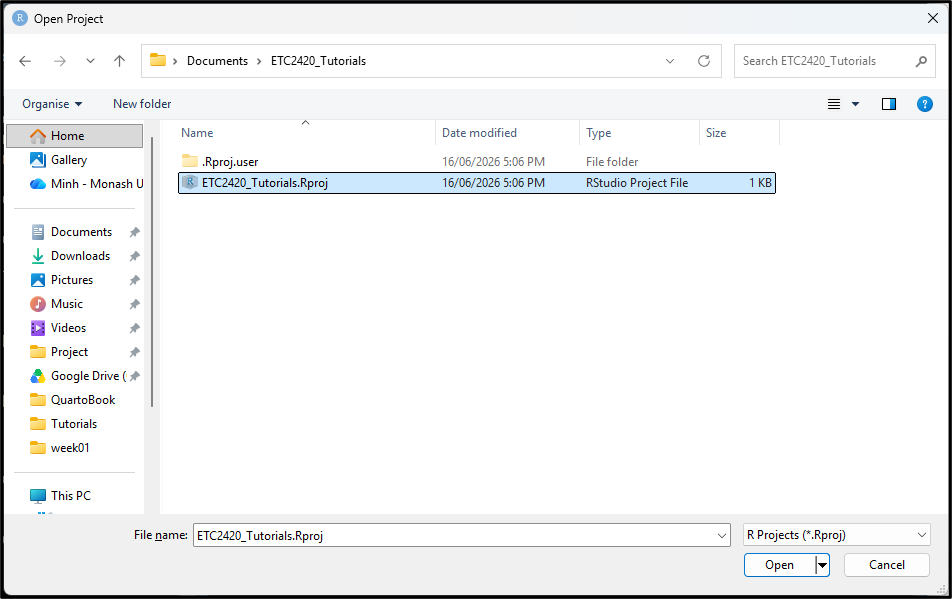
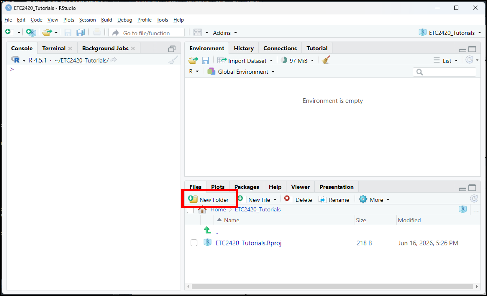
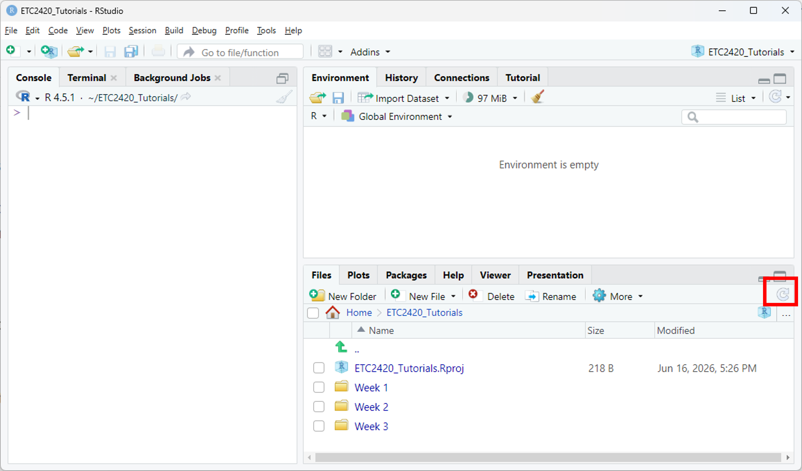
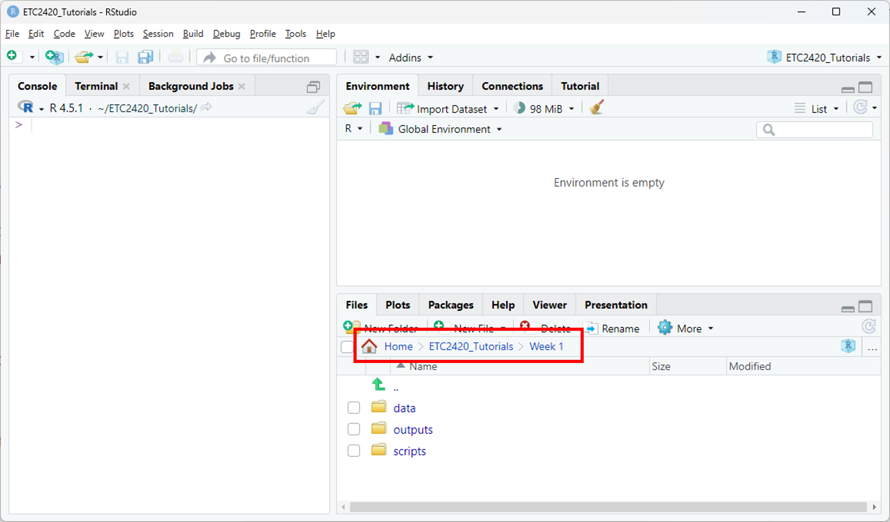

All of the tutorial activities that you complete in this unit will be conducted using R/RStudio and Quarto. We recommend you create a Project folder on your device and place all of your files there.

::: callout-note

### Important

Aim to have an RStudio Project Folder set up (see instructions on this page) prior to your first tutorial (in Week 1).

:::

## 1. Installing R and RStudio

*If you already have R and RStudio installed, you can skip to Step 2.*

You will need to install **both** R and RStudio. Depending on your operating system, the instructions will be different:

### Installing R (**Do this first**)

::: panel-tabset
#### Windows

1.  Open your web browser and go to the <a href="https://cran.r-project.org/" target="_blank" rel="noopener"> R Projectwebsite</a>.
2.  Under the "Download and Install R" section, click on the "Download R for Windows" Link
3.  On the next page, click "base" to download the base distribution of R.
4.  Click on the "Download R x.x.x for Windows" link (the version number will vary).
5.  Once the file has been downloaded, run the `.exe` file (by default it will go to your 'My Downloads' folder and will look something like R-x.x.x-win.exe)
6.  Click through the installation wizard to finish installation.

#### macOS

1.  Open your web browser and go to the <a href="https://cran.r-project.org/" target="_blank" rel="noopener"> R Projectwebsite</a>.
2.  Under the "Download and Install R" section, click on the "Download R for macOS" Link
3.  On the next page, click the “R-4.x.x.pkg” link (where “x.x” will be the version number) to download the R installer for macOS. This will download a .pkg file.
4.  After downloading the .pkg file, open it to start the installation process.
5.  Follow the on-screen instructions in the installation wizard
:::

### Installing RStudio (**Do this second**)

::: panel-tabset
#### Windows

1.  Open your web browser and go to the <a href="https://posit.co/download/rstudio-desktop/" target="_blank" rel="noopener"> RStudio website</a>.
2.  Under the “RStudio Desktop” section, click on the Download RStudio button.
3.  You will be directed to a page where you can select the version of RStudio for your operating system. Select RStudio for Windows.
4.  Click on the Download RStudio Desktop button to download the installer for Windows. It will download a .exe file.
5.  After downloading the .exe file, open the executable file, and follow the instructions in the installation wizard.

#### macOS

1.  Open your web browser and go to the <a href="https://posit.co/download/rstudio-desktop/" target="_blank" rel="noopener"> RStudio website</a>.
2.  Scroll down to the “RStudio Desktop” section and click Download RStudio.
3.  On the next page, under RStudio Desktop for macOS, click Download RStudio Desktop (this will download the .dmg file).
4.  After the .dmg file has downloaded, locate the file and double-click it to open the disk image.
5.  A new window will appear showing the RStudio application icon. Drag the RStudio icon into your Applications folder.
6.  Once the application is copied to the Applications folder, you can close the disk image window.
:::

## 2. Creating a Project Folder

To create a project in RStudio:

1. Go to File → New Project
2. Choose New Directory
3. Choose New Project
4. Give it a directory name and choose where this folder will be placed (e.g. your "My Documents" folder).

 

5. Then click the `Create Project` button.

RStudio will now create a new Project folder on your computer. When opened, it looks something like:

 

## 3. Opening a Project

If you close your RStudio, you can reopen this Project by:

1. File → Open Project
2. Navigating to the Project Folder (e.g. "My Documents" > "ETC2420_Tutorials")
3. Clicking on the file that has the `.Rproj` extension.

 

**Note:** if RStudio is not opened, you can click on this file directly which will open up both the project and RStudio.

## 4. Creating sub folders

To organise our files (as we plan to use this Project Folder) for the whole semester, we can create sub folders for the weekly content. You can do this a few different ways. For example:

1. Create them manually from your window (e.g. "Right Click" > "New" > "Folder"), then provide it a name (e.g. "Week 1"). And repeat for how many folders you would like to make.
2. Directly in RStudio, from the `Files` tab, click on `New Folder`, then provide it a name (e.g. "Week 1") and click okay. And repeat for how many folders you would like to make.

 

For now, let's just make folders for the first three weeks (**note:** you may need to click the refresh button to see them in your project folder)

 

You can also create folders within folders. For example, some people (myself included) like to have separate folders within each of you weekly folders that include:

- data
- scripts
- outputs
- etc

 

