## About

This first tutorial is about getting started with Quarto.

You should already have R and RStudio installed (if not, see the **Getting Started** Chapter). In this tutorial, we will use those tools as our starting point and focus on creating, editing, and rendering a Quarto document. Since this is a second-year unit, we will assume that you have seen R and RStudio before. However, we will not assume that everyone feels equally confident using them. Some students may have used R recently, while others may feel rusty. Some students may be comfortable writing code, while others may still feel uncertain about where code should go, how to run it, or how to interpret error messages.

That is okay. The goal of this first tutorial is not to do advanced statistics. The goal is to make sure that you can open RStudio, create a Quarto document, write some basic text, add simple R code chunks, and render the document successfully. By the end of this tutorial, you should have a working Quarto document that combines text, headings, basic formatting, R code, and output. This document will be a foundation for the tutorial work you complete later in the unit.

## Objectives

-   install or check Quarto
-   open RStudio and check that R is working
-   run some basic R commands
-   create a simple Quarto document
-   write text and code in the same document
-   render the document to check that everything works

## Tasks

### 1. Open up the Project Folder

In the **Getting Started** chapter, we created an RStudio Project folder that can be used to store the files and activities we complete throughout this unit. Let's begin by opening this project.

1.  File → Open Project
2.  Navigating to the Project Folder (e.g. "My Documents" \> "ETC2420_Tutorials")
3.  Clicking on the file that has the `.Rproj` extension.

<center></center>

<br>

### 2. Installing Quarto

If you’re using a recent version of RStudio, Quarto will already be installed and ready for you to use. If you have trouble rendering documents, you may need to install or update Quarto - detailed instructions for this can be found [here](https://quarto.org/docs/get-started/).

### 3. Setting up a Quarto document

From RStudio:

1.  Click on `File` \> `New File` \> `Quarto Document`
2.  Choose the document type. For now, we'll use `Document` and keep it as `HTML`.

<center>

```{r, echo=FALSE}
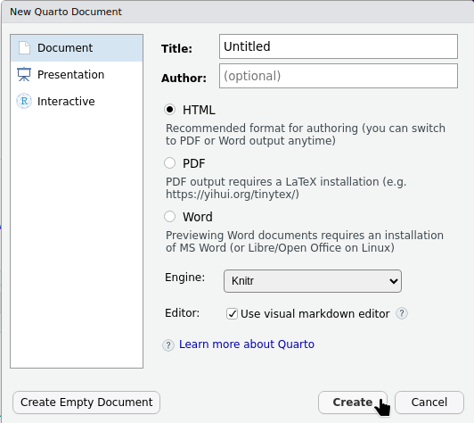
```

</center>

<br>

3.  Click `Create` to generate your Quarto document.
4.  RStudio will create a default Quarto document that looks like:

<center>

```{r, echo=FALSE}
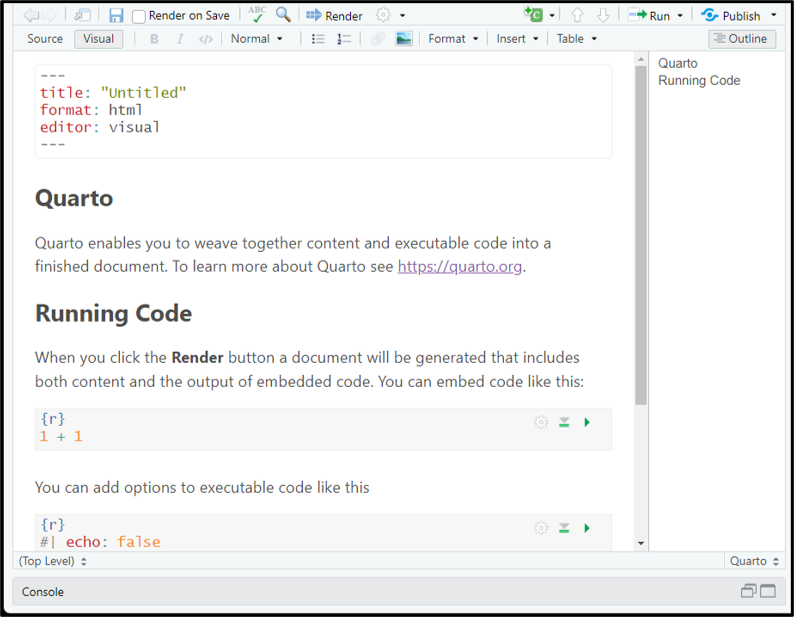
```

</center>

<br>

### 4. Source vs Visual Editor

At the top of your Quarto document you'll see two buttons: `Source` and `Visual`. These are two different ways of editing the same document.

<center>

```{r, echo=FALSE}
#| classes: .enlarge-image
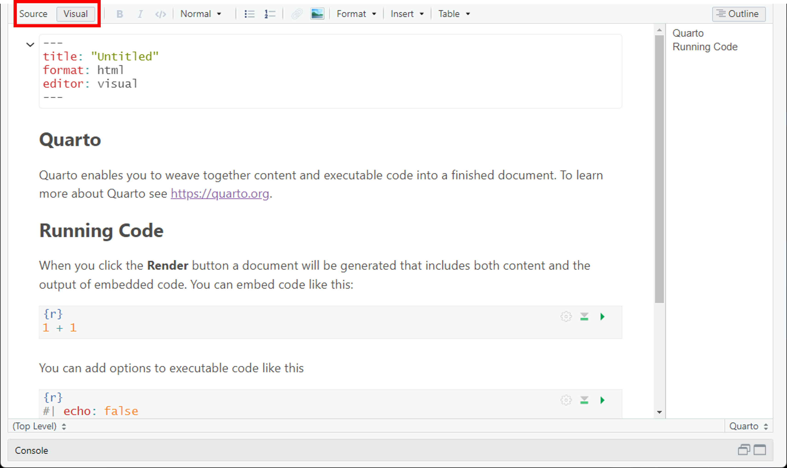
```

</center>

<br>

-   The Source editor shows the underlying Quarto markdown. This means you can see the symbols that control headings, code chunks, bold text, lists, links, and other formatting.
-   The Visual editor looks more like a word processor. Instead of seeing all the markdown symbols, you see something closer to the final formatted document. Headings look like headings, bold text appears bold, and lists look like lists.

Both editors are working with the same Quarto document. You can switch between Source and Visual at any time. For this unit, you are welcome to use either editor. However, it is useful to become familiar with Source mode because it helps you understand the structure of a Quarto document. When something goes wrong, Source mode often makes it easier to see the problem. **The tasks below use Source mode.**

### 5. Rendering your document

At the top of your Quarto document, you should see a button called `Render`.

<center>

```{r, echo=FALSE}
#| classes: .enlarge-image
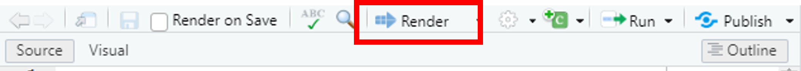
```

</center>

<br>

Rendering means turning your .qmd file into a finished document. For example, if your Quarto document is set to render as HTML, clicking Render will create an HTML page. If you have the Viewer pane open in RStudio, the rendered document may appear there. Depending on your settings, it may also open in a browser window.

Try clicking `Render` now to create the output. You can also use shortcuts:

-   `Ctrl + Shift + K` for Windows
-   `Cmd + Shift + K` for Mac

When you Render your document for the first time, RStudio will ask where you would like your output saved. If you followed along with the **Getting Started** Chapter, you will have a Week 1 folder in your working directory. Save it in this location.

<center>

```{r, echo=FALSE}
#| classes: .enlarge-image
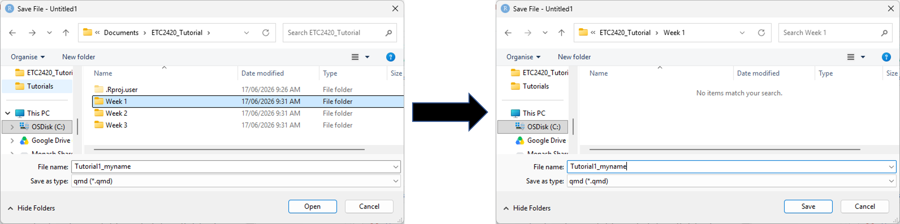
```

</center>

<br>

### 6. YAML

When you open up your Quarto document, you will notice a block of text that is surrounded by dashes

``` yaml
---
title: "Untitled"
format: html
editor: visual
---
```

This is the `YAML` header, which contains metadata about your document, such as the title, author, and editor (although currently it only has a title).

Let's add the following as options in our YAML:

``` yaml
---
title: "ETC2420/5242: Tutorial 1"
subtitle: "Getting started"
author: "Your name"
format: html
date: today
---
```

Then `Render` your document once again and you should see something like:

<center>

```{r, echo=FALSE}
#| classes: .enlarge-image
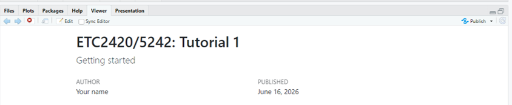
```

</center>

<br>

There are a lot of other options we can configure with our YAML header. See this link [here](https://quarto.org/docs/reference/formats/html.html) for the full list.

Let's now delete everything in the default document, except for the YAML that we just updated. This will allow us to create our own content. Do this, then `Render` the document once again to see the changes:

<center>

```{r, echo=FALSE}
#| classes: .enlarge-image
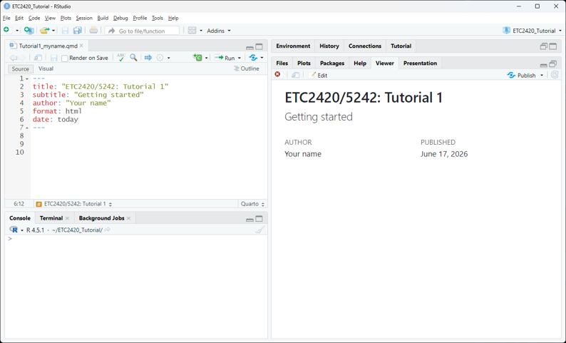
```

</center>

<br>

### 7. Writing text

A Quarto document is not just a place to write code. It is also a place to write explanations. This is important because statistical work usually needs both:

-   the code that produces the result
-   the written interpretation that explains the result

In Quarto, ordinary text is written directly into the document. You do not need any special symbols for normal sentences and paragraphs.

For example, try writing "This is my first Quarto document" directly below your YAML header.

``` default
---
title: "ETC2420/5242: Tutorial 1"
subtitle: "Getting started"
author: "Your name"
format: html
date: today
---

This is my first Quarto document
```

Then `Render` the document once again. Your output should now look like:

<center>

```{r, echo=FALSE}
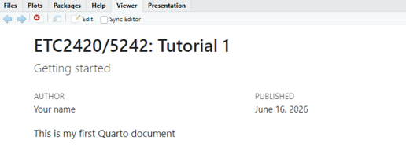
```

</center>

<br>

### 8. Headings

You can create headings in your Quarto document using the `#` symbol. The number of `#` symbols indicates the level of the heading. For example, `#` creates a first-level heading, `##` creates a second-level heading, and so on.

Update your document so that it contains the following:

``` default
---
title: "ETC2420/5242: Tutorial 1"
subtitle: "Getting started"
author: "Your name"
format: html
date: today
---

This is my first Quarto document

# About me

This section contains information about me.

## My Studies

## My Interests
```

Then `Render` the document:

<center>

```{r, echo=FALSE}
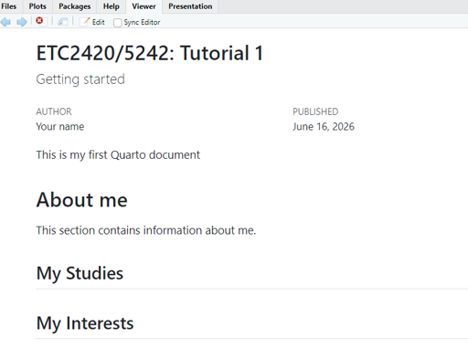
```

</center>

<br>

Notice here that `# About me` is a larger heading than `## My Studies` and `## My Interests`. This is because `# About me` is a first-level heading, while `## My Studies` and `## My Interests` are second-level headings. You can think of the second-level headings as sections that sit inside the larger About me section.

When the document is rendered, the headings will be formatted differently from ordinary text. They may also appear in the table of contents if your document has one. A good Quarto document should use headings to organise ideas clearly. For example, instead of writing one long block of text, headings allow you to separate your work into meaningful sections.

### 9. Lists

Unordered lists can be created using `*` or `-`, with indentation used to indent list items. Numbered lists can be created with 1., 2., and so on. You can also create checklists by using `- [ ]` for an empty box and `- [x]` for a checked box.

Update your Quarto document by including 3 listed items in `My Studies` and `My Interests`. See below for an example (but you should update this for your own situation).

``` default
---
title: "ETC2420/5242: Tutorial 1"
subtitle: "Getting started"
author: "Your name"
format: html
date: today
---

This is my first Quarto document

# About me

This section contains information about me.

## My Studies

Currently I am studing a Bachelor of Spreadsheet Wizardry, majoring in Copying Code from the Internet and a minor in Forgetting to Save my Work. The units I am taking are:

- ETC9: Introduction to Panic-Driven Analysis
- ETC12: Advanced Copy and Paste Techniques
- ETC5: Debugging by Randomly Changing Things
- ETC67: Professional File Naming

## My Interests

1. opening RStudio and immediately forgetting why
2. making plots with axis labels that are almost useful
3. telling myself “just one more change” before breaking the whole document
4. pressing Render with the same emotional intensity as submitting an assignment
```

<center>

```{r, echo=FALSE}
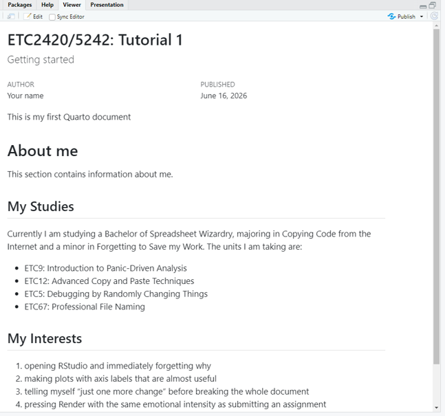
```

</center>

<br>

### 10. Text formatting

You can format your text (e.g. **bold**, *italics*, ~~strikethrough~~, etc.) by placing symbols around the text you would like to format.

-   To make text **bold**, place two sets of `**` around the text: `**bold text**`.
-   To make text *italic*, place one set of `*` around the text: `*italic text*`.
-   To use ~~strikethrough~~, place two sets of `~~` around the text: `~~strikethrough text~~`.
-   To show `inline code`, place one backtick around the text: `` `mean()` ``.
-   To create a link, use square brackets followed by parentheses: `[Quarto](https://quarto.org)`.
-   To write subscript, use `~` around the text: `H~2~O`.
-   To write superscript, use `^` around the text: `x^2^`.
-   To create a quote, place `>` at the start of the line.

Now, update your Quarto document by **bolding** your Bachelor, and *italics* your Major and Minor (if they apply to you - if they don't then just practice on some other text). Try to add backticks \`\` somewhere in your text as well.

<center>

```{r, echo=FALSE}
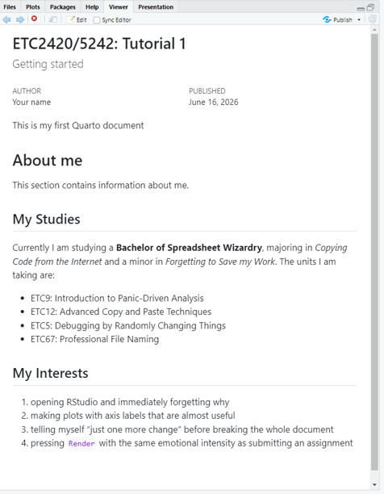
```

</center>

<br>

### 11. Table of Contents (TOC)

As your Quarto document becomes longer, it can be useful to add a table of contents. A table of contents lists the headings in your document and helps the reader move between sections. It is especially useful when your document has several questions, sections, or code examples.

To add a table of contents, update the YAML header to include \`toc. Note: When adding a table of contents, the indentation matters. In the YAML header, some lines belong underneath other lines. This tells Quarto that the table of contents option belongs to the HTML output format.

``` yaml
---
title: "ETC2420/5242: Tutorial 1"
subtitle: "Getting started"
author: "Your name"
format: 
  html: 
    toc: true
date: today
---
```

<center>

```{r, echo=FALSE}
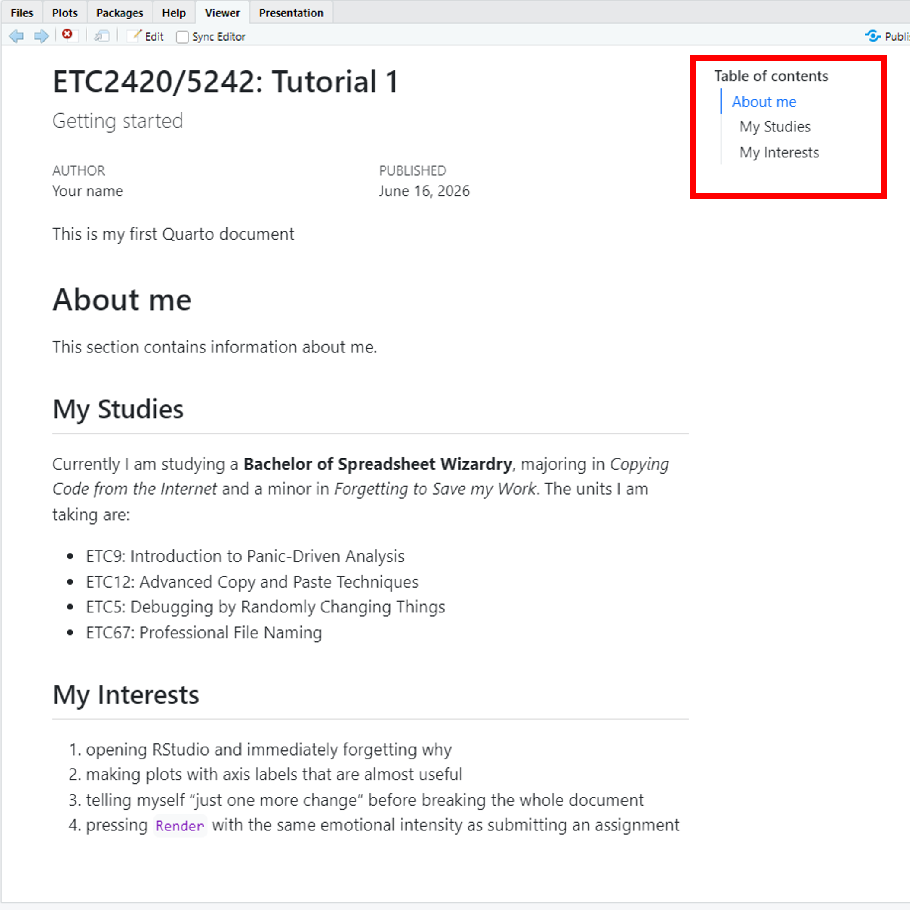
```

</center>

<br>

### 12. Code chunks

So far, we have used Quarto to write ordinary text. The next step is to add R code. In Quarto, R code is usually written inside a **code chunk**. A code chunk is a special section of the document that tells Quarto:

> Run this as R code.

A basic R code chunk looks like this:

<center>

```{r, echo=FALSE}
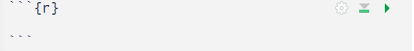
```

</center>

<br>

The code chunk begins with three backticks, followed by `{r}`. This tells Quarto that the code inside the chunk is written in R. The code chunk ends with three backticks.

#### 12.1 Adding a code chunk

There are a few ways to add a code chunk in RStudio.

1.  One way is to use the menu

<center>

```{r, echo=FALSE}

```

</center>

<br>

2.  You can also use the keyboard shortcut:

-   Windows: **Ctrl + Alt + I**
-   macOS: **Command + Option + I**

This will insert an empty R code chunk into your document.

#### 12.2 Writing code in a code chunk

Now, insert two code chunks into your Quarto document: one within the **My Studies** section, and one within the **My interests** section. We will just insert some simple arithmetic into these two code chunks.

```{r, eval=FALSE}
x <- 1
y <- 2
x+y
```

```{r, eval=FALSE}
x^2 + y^2
```

<center>

```{r, echo=FALSE}
#| classes: .enlarge-image
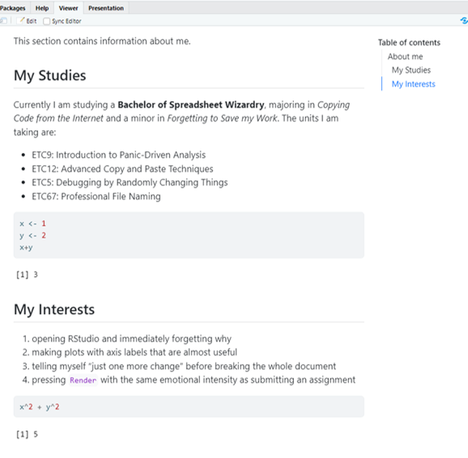
```

</center>

<br>

Notice that in the rendered document both the code and the output is provided. This is useful because it allows the reader to see what you asked R to do and what R returned.

Sometimes, however, you may not want both the code and the output to appear in the final document. For example, you might want to show only the output, or you might want to run code in the background without displaying it. Quarto lets you control this using chunk options.

Some useful code chunk options are:

-   `echo: false`: Runs the code, but hides the code in the rendered document. The output will still appear.
-   `eval: false`: Shows the code, but does not run it. This is useful when you want to show an example without producing output.
-   `include: false`: Runs the code, but hides both the code and the output. This is useful for setup code.
-   `message: false`: Hides messages produced by the code. This is often useful when loading packages.
-   `warning: false`: Hides warnings produced by the code. Use this carefully: warnings can sometimes contain important information.
-   `error: true`: Allows the document to keep rendering even if the code chunk produces an error. This can be useful when you are deliberately showing an example of an error.

You can include these settings directly into your code chuck by including `#|` within the code. For example, update your code chunks such that:

<center>

```{r, echo=FALSE}
#| classes: .enlarge-image
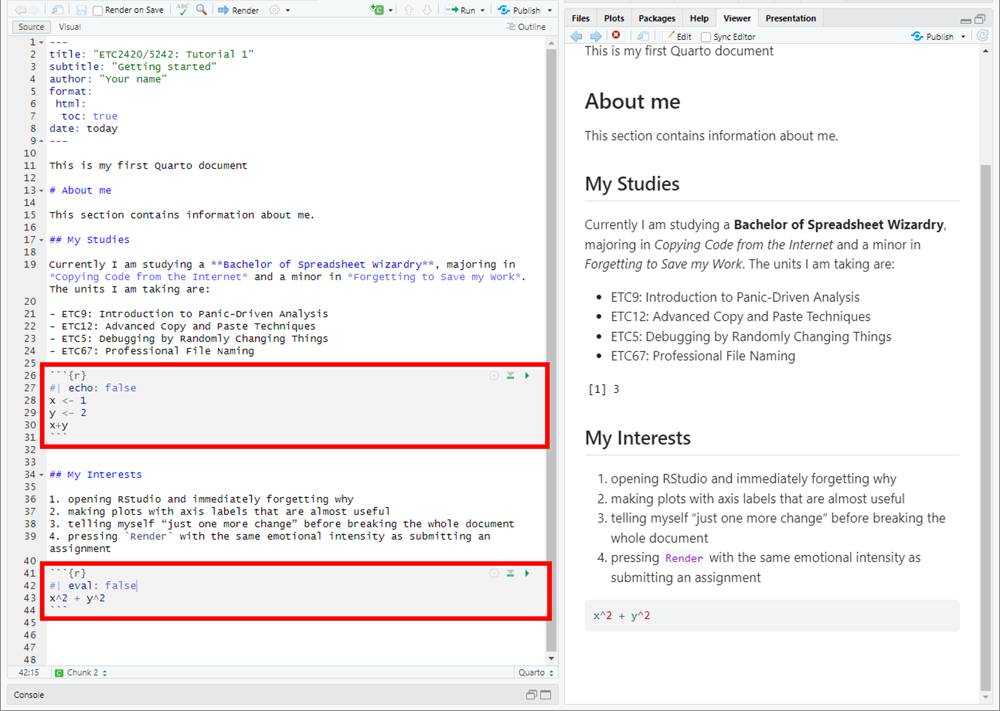
```

</center>

<br>

-   The first code chunk includes `echo: false`, which means the code will run and the output is shown (but the code is hidden). This is why when we look at the rendered document we just see `[1] 3`.
-   The second code chunk includes `eval: false`, which means that the code is shown, but it won't run. That's why when we look at the rendered document, all we see is the code, and no output.

### 13. Additional resources.

There are a lot of other ways in which we can customise our Quarto document. Please see the guide below for examples:

<https://quarto.org/docs/authoring/markdown-basics.html>

## Homework

1.  Create a new Quarto document called "Week 1 Homework" and save it in your Week 1 folder.
2.  Update the document so that it looks like:

<center>

```{r, echo=FALSE}
#| classes: .enlarge-image
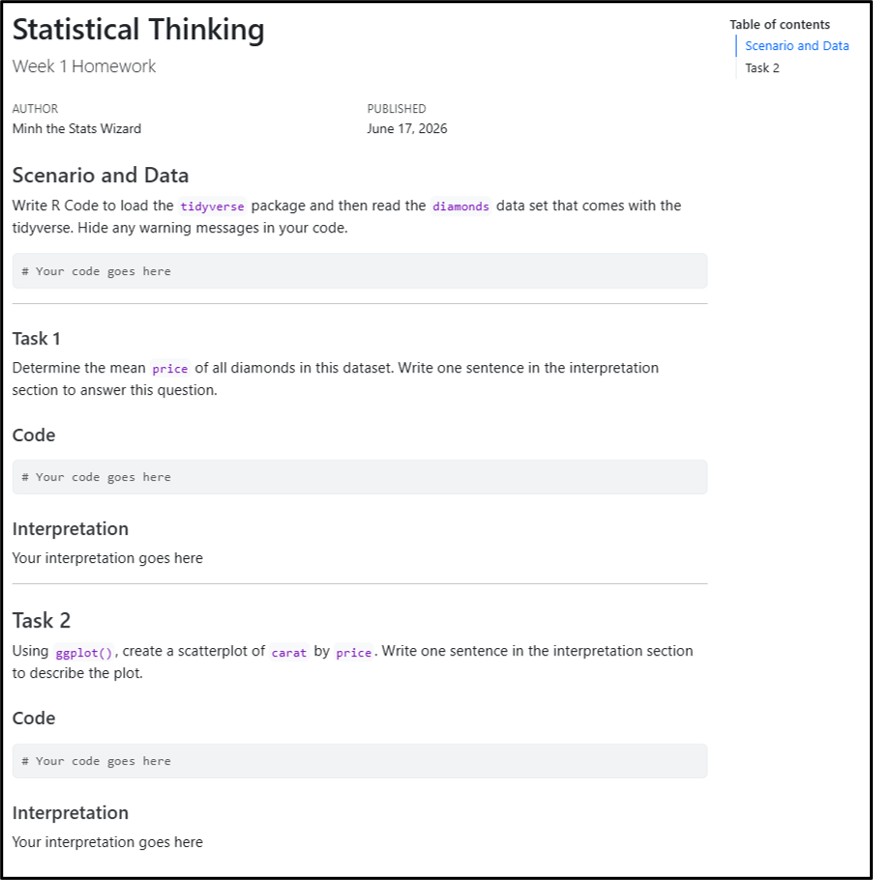
```

</center>

<br>

3.  Change the author to your name
4.  Change the date to today's date.
5.  Where you see "\# Your code goes here", replace this with actual R code to answer the questions.
6.  Where you see "Your interpretation goes here", replace this with your answer to the questions.
7.  `Render` and save the document.
